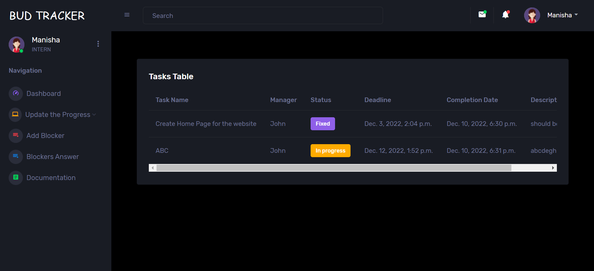
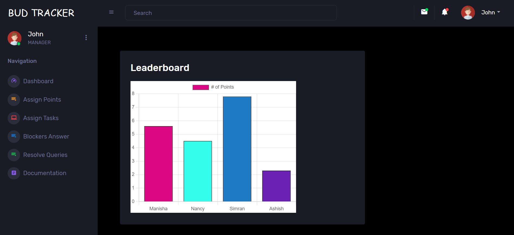

# BudTracker

#### The Intern Tracker Webapp. 

## About the Project
An interactive web app for tracking the different tasks assigned to interns during their internship period. The web app should have role-based access, one for managers and the other for interns which caters to the following use case –
1.Functionalities for Interns –

  1.Profile page having basic information of the intern like Profile picture, Name, DOJ etc.
  2.Home Page showing different tasks assigned to interns by their managers, with their deadlines.
  3.Interns can keep updating the progress of their task and add any blockers/concerns they face in their projects.
2.Functionalities for Managers –  

  1.Profile page having basic information of the manger like Profile picture, Name, DOJ etc.
  2.Home page where they can assign different tasks to the interns tagged to them in the web app along with other details like SPOCs, deadlines, assign them points after completion of each task etc.
  3.A report page which gives an analysis of interns’ bandwidth, progress and a leaderboard on basis of the points assigned.
 
